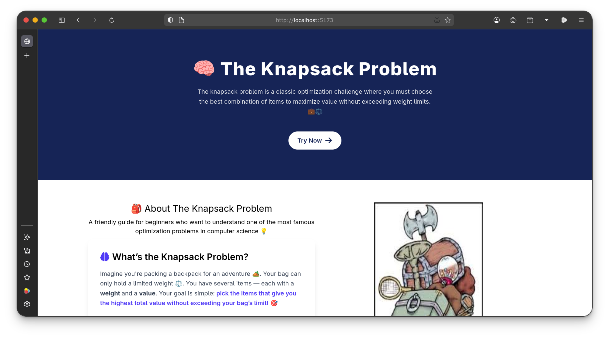

<div align="center">

  

  <h2>🎒 Knapsack Problem Solver : Interactive Learning Project for the 0/1 Knapsack Algorithm</h2>

  <p>
    An interactive and educational implementation of the <b>0/1 Knapsack Problem</b>  
    built with <b>React</b> and <b>TypeScript</b>.
  </p>

</div>

   

## Description

The **Knapsack Problem Solver** is an interactive web-based application designed to help users understand and experiment with the **0/1 Knapsack algorithm**.

It provides a visual and hands-on way to explore how dynamic programming is used to solve optimization problems efficiently.

## Documentation & Learning Resources

You should see my documentation [Here](/docs/docs.md)

Another, to better understand the algorithm, here are some useful resources:

- 📘 [https://en.wikipedia.org/wiki/Knapsack_problem](https://en.wikipedia.org/wiki/Knapsack_problem)
- 📗 [https://www.geeksforgeeks.org/0-1-knapsack-problem-dp-10/](https://www.geeksforgeeks.org/0-1-knapsack-problem-dp-10/)
- 🎥 [https://www.youtube.com/results?search_query=knapsack+problem+dynamic+programming](https://www.youtube.com/results?search_query=knapsack+problem+dynamic+programming)

## Features

- **0/1 Knapsack Algorithm Implementation**
  Efficient solution using dynamic programming.

- **Interactive Experimentation**
  Test different item sets and capacities in real time.

- **Visualization Ready**
  Helps understand how optimal solutions are built step by step.

- **User-Friendly Interface**
  Simple and intuitive UI built with React.

- **Fast Computation**
  Optimized logic using TypeScript.

## Tech Stack

- ⚛️ React
- 🟦 TypeScript
- 🎨 Tailwindcss
- 🧠 Dynamic Programming

## Getting Started

### 📦 Installation

```bash
git clone git@github.com:ranto-dev/Knapsack_Problem.git
cd Knapsack_Problem
```

### ▶️ Run the project

```bash
# install dependencies
npm install

# start development server
npm run dev
```

## Upcoming Features

- [ ] Step-by-step visualization of DP table
- [ ] Graphical representation of selected items
- [ ] Support for Fractional Knapsack
- [ ] Import/export dataset (JSON/CSV)
- [ ] Interactive learning mode (guided explanations)
- [ ] Responsive UI improvements
- [ ] Deployment (Vercel / Netlify)
